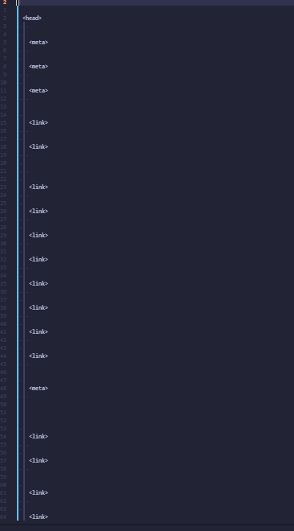
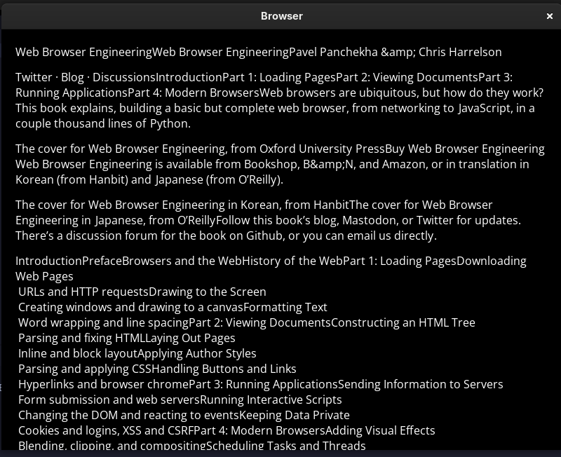

## An attempt at implementing the book [Web Browser Engineering](https://browser.engineering/) **_by Pavel Panchekha & Chris Harrelson_** in C++20

The original book's implemented in python.

> **NOTE:** inter chapter commits are done in the branch chp<x>-working. It's merged with master once I complete the chapter and the executable's functional!!

### Current Status (Latest Sept 13)

#### Chapter 4 - Completed (Sept 7 2026)

New project structure w/ some description:

```
├── assets //fonts and images (images are only used in this README for now)
│   ├── fonts
│   │   ├── NotoSansSC-Bold.ttf //for CJK characters
│   │   ├── NotoSansSC-Regular.ttf //for CJK characters
│   │   ├── OpenSans-BoldItalic.ttf
│   │   ├── OpenSans-Bold.ttf
│   │   ├── OpenSans-Italic.ttf
│   │   └── OpenSans-Regular.ttf
│   └── image
│   ├── chp-1.png
│   ├── chp-2-mid.png
│   ├── chp3-complete-1.png
│   ├── chp3-complete-2.png
│   ├── chp4-complete-1.png
│   └── chp4-complete-2.png
├── CMakeLists.txt
├── include
│   ├── client.hpp //SSL Client to create the TCP connection
│   ├── fonts.hpp //Font caching mechanism implementation
│   ├── helpers.hpp //some helper structs, classes and hlp namespace functions
│   ├── HTMLParse.hpp //creates HTML DOM tree and it's main parse() function returns the root
│   ├── layout.hpp //uses the HTML tree to create a vector of DisplayItems which holds TTF_Text for each character to be rendered
│   ├── rio.hpp //robust I/O for communications over TCP, help from CS:APP book
│   ├── url.hpp //URL and response parsing
│   └── window.hpp // GUI interface implemented with SDL3, text rendered with SDL3_ttf
├── output.txt //html tree output
├── README.md
└── src
    ├── client.cpp
    ├── fonts.cpp
    ├── helpers.cpp
    ├── HTMLParse.cpp
    ├── layout.cpp
    ├── main.cpp
    ├── rio.cpp
    ├── url.cpp
    └── window.cpp
```

- HTML tags and text are now in DOM tree structure
- All edge cases mentioned in book such as non closing tags, empty space before first tag, first/last tags are taken care of.
- [output.txt](output.txt) contains the output sample of the DOM
- HTML DOM sample:
  
- Rendering [this](https://browser.engineering/examples/index.html)
  

### Requirements for anybody wanting to run it

- CMake > 3.8
- C++20 capable compiler
- OpenSSL 3.5.7
- SDL3 and SDL3_ttf

  ```
  git clone https://github.com/Rhythmic-Ocean/Browser.Engineering-in-Cpp
  cd Browser
  cmake -B build
  cmake --build build
  cd build
  ./Browser https://browser.engineering/examples/xiyouji.html
  ```

### Next Step: Chapter 5!!
