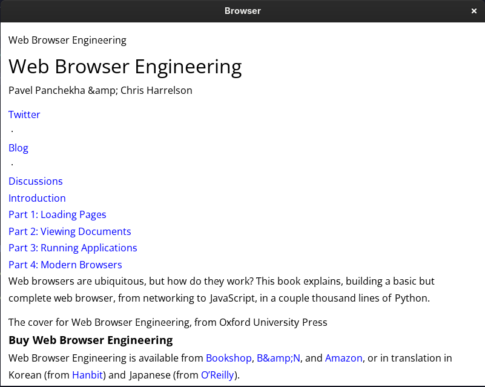
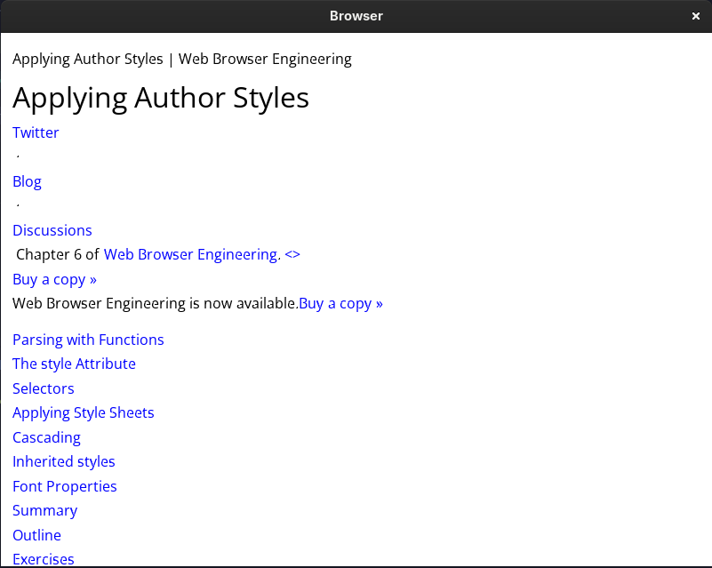

## An attempt at implementing the book [Web Browser Engineering](https://browser.engineering/) **_by Pavel Panchekha & Chris Harrelson_** in C++20

The original book's implementation is in python.

> **NOTE:** inter chapter commits are done in the branch chpX-working. It's merged with master once I complete the chapter and the executable's functional!!

> This is a learning project, basically my first C++ project after doing learncpp. So probably a lot of errors.

> I aim to have as little AI generated code as possible in this repo. NOT ANTI-LLM, it's just for me to learn the language and how browsers work.

### Current Status (Latest Sept 27)

#### Chapter 6 - Completed (Sept 27 2026)

- Now parses CSS, can render few styles with inline CSS and external CSS.
- For external CSS, supports tag selectors and descending tag selectors
- Properties are cascading so child tags automatically inherit their parents properties unless overridden.
- Has a default browser specific CSS template (see css/Browser.css) that is inherited by all elements unless overridden
- Re-wrote attribute splitter for HTML Parser, so it's deviates quite a bit from the book's implementation there
- Proper error handling for cases where parsing fails due to bad html/css inputs
- Compiled with multiple -W flags (see CMakeLists.txt), and cleaned up all the warnings
- Successful examples presented below:

- Rendering [this](https://browser.engineering/index.html)


  
  
- Rendering [this](https://browser.engineering/styles.html)


  

### Requirements for anybody wanting to run it

- CMake >= 4.3.0
- C++20 capable compiler
- OpenSSL 3.5.7
- SDL3 and SDL3_ttf

### Steps

- Fork the repo
- Run the following on your linux system:

  ```
  git clone https://github.com/<your-username>/Browser.Engineering-in-Cpp
  cd Browser
  cmake -B build
  cmake --build build
  cd build
  ./Browser https://browser.engineering/examples/xiyouji.html
  ```

### Next Step: Chapter 7
